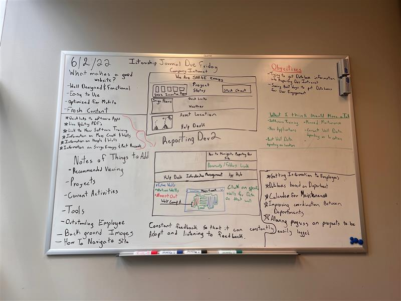

# Hello World!

## Table of Contents

[[toc]]

## Contact Me

#### Email- davidjmontgomery350@gmail.com

#### Phone- 281-630-1525

#### LinkedIn- https://www.linkedin.com/in/david-montgomery-00ab051b5/

## Portfolio

[contact](/contact)

[contact](/contact.md)

[contact](/contact.html)

## Code Example

```js
console.log(#include <iostream>); The Date is 6/1/22
```

## Interns

| Interns    | David Montgomery              | Sofia Del Aguila                      | Stefanie Chapa  | Leo Zeng   | Cameron Matthews              | Cameron Robicheaux |
| ---------- | ----------------------------- | ------------------------------------- | --------------- | ---------- | ----------------------------- | ------------------ |
| Department | Information Delivery Services | Health, Safety and Environment Remark | Human Resources | Operations | Information Delivery Services | Human Resources    |

**bold**

_italic_

## David's Internship Blog

#### 5/25/22

This was my introduction to Documentation Sites. Taj helped me Organize this.

#### 5/26/22

Today I had an Meeting with the IDS team and we talked about what we were working on and the Status Updates of some of our completed projects along with some that we are still working on. Me and my fellow interns had lunch with Travis and James Welch.

#### 5/27/22

Today I finished my Internship journal and had a meeting with Curtis and Cameron about the background of the IDS department and how its gotten to where it is now. Which gave me a lot of insight because if I want to make changes to the Intranet. I have to to understand where its came from. I also showed them some of my visions for the future and an improved layout to the Reporting Development Site.

#### 5/31/22

Today I had a Team Meeting with the IDS department about the status of our individual projects. Curtis's main goal is the make the new intranet self serving. Taj also brought up a good point that their also has to be a Training System for the new intranet because people will need to know where to go to get certain information.

#### 6/1/22

Learned the right way to set up a website from scratch. Talked with Stefanie today also because she can now edit the Human Resources Page on the Intranet. Taj overall is helping me become a better programmer and web developer. Met some new people on the 3rd floor which was pretty cool.

#### 6/2/22

Having a IDS Touch Base meeting today. Also being introduced to the Surge Summer Internship Budyu Program today. My Cross department buddy is Matt Gallant which I already met yesterday, Hes really cool. My Intradepartmental Buddy is Taj, who we already know. Very Fun Day.

## SharePoint & Intranet Research

Some things that Ive noticed about the Intranet just as some points that I have covered with Curtis. He want s a progress tracker. Better Data Management. 2 Factor Authentication. Data Subscription tab. Notifications on Software Shutdowns. Read Emails. Help Desk Analytics. Self Serving Intranet.


